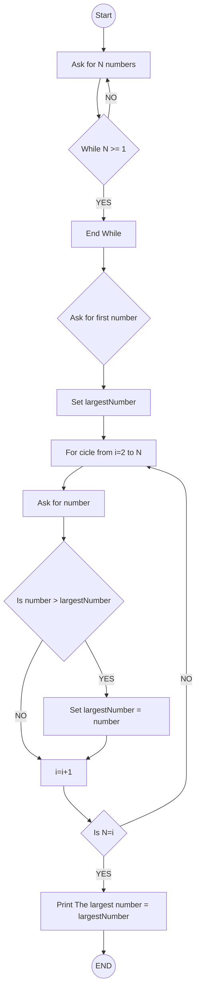
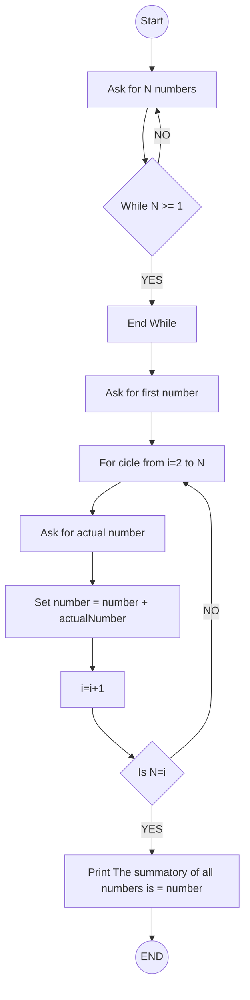
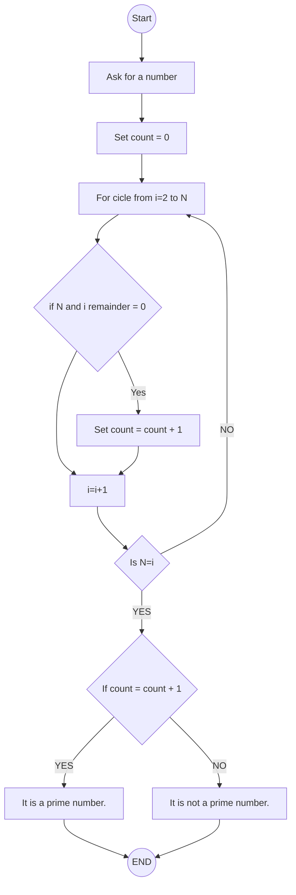

# Table of Contents
1. [Find the Largest Number]()
# 1. Sum of Numbers
Write an algorithm that takes two numbers as input and returns their sum.

# 2. Largest Number
Create an algorithm that receives three numbers and determines which one is the largest.

# 3. Find the Largest Number
Write an algorithm that receives a list of numbers and returns the largest number in the list.
## 3.1 Flow

## 3.2 Code: Batch
``` Batch
@echo off
setlocal enabledelayedexpansion

:START
set /p N=Enter the number of inputs: 

if %N% LSS 1 (
    echo N must be greater than or equal to 1
    goto START
)

rem Initialize variables
set /p largestNumber=Enter number 1: 

rem Loop from 2 to N
for /l %%i in (2,1,%N%) do (
    set /p number=Enter number %%i: 
    if !number! GTR !largestNumber! (
        set largestNumber=!number!
    )
)

rem Print the largest number
echo The largest number is !largestNumber!
@echo off
setlocal enabledelayedexpansion

rem Simulate a while cicle with START and goto.
:START
set /p N=Enter the number of inputs: 

if %N% LSS 1 (
    echo N must be greater than or equal to 1
    goto START
)

rem Initialize variables
set /p largestNumber=Enter first number: 

rem Loop/for cicle from 2 to N
for /l %%i in (2,1,%N%) do (
    set /p number=Enter number %%i: 
    if !number! GTR !largestNumber! (
        set largestNumber=!number!
    )
)

rem Print the largest number
echo The largest number is !largestNumber!
@echo off
setlocal enabledelayedexpansion

:START
set /p N=Enter the number of inputs: 

if %N% LSS 1 (
    echo N must be greater than or equal to 1
    goto START
)

rem Initialize variables
set /p largestNumber=Enter number 1: 

rem Loop from 2 to N
for /l %%i in (2,1,%N%) do (
    set /p number=Enter number %%i: 
    if !number! GTR !largestNumber! (
        set largestNumber=!number!
    )
)

rem Print the largest number
echo The largest number is !largestNumber!
@echo off
setlocal enabledelayedexpansion

:START
set /p N=Enter the number of inputs: 

if %N% LSS 1 (
    echo N must be greater than or equal to 1
    goto START
)

rem Initialize variables
set /p largestNumber=Enter number 1: 

rem Loop from 2 to N
for /l %%i in (2,1,%N%) do (
    set /p number=Enter number %%i: 
    if !number! GTR !largestNumber! (
        set largestNumber=!number!
    )
)

rem Print the largest number
echo The largest number is !largestNumber!
@echo off
setlocal enabledelayedexpansion

:START
set /p N=Enter the number of inputs: 

if %N% LSS 1 (
    echo N must be greater than or equal to 1
    goto START
)

rem Initialize variables
set /p largestNumber=Enter number 1: 

rem Loop from 2 to N
for /l %%i in (2,1,%N%) do (
    set /p number=Enter number %%i: 
    if !number! GTR !largestNumber! (
        set largestNumber=!number!
    )
)

rem Print the largest number
echo The largest number is !largestNumber!
```
# 4 Sum of Elements
Create an algorithm that sums all the elements in a list.

## 4.1 Flow


## 4.2 Code: Batch
``` Batch
@echo off
setlocal enabledelayedexpansion

rem Simulate a while cicle with START and goto.
:START
set /p N=Enter the number of inputs: 

if %N% LSS 1 (
    echo Must be greater than or equal to 1
    goto START
)

rem Initialize variables
set /p number=Enter first number: 

rem Loop/for cicle from 2 to N
for /l %%i in (2,1,%N%) do (
    set /p actualNumber=Enter number %%i: 
    set /a number= number + actualNumber
)

rem Print the sums of all elements
echo The sums of all numbers is !number!
```

# 5. Prime Number
Design an algorithm that determines if a number is prime or not.

## 5.1 Flow


## 5.2 Code: Batch
``` Batch
@echo off
setlocal enabledelayedexpansion

rem Simulate a while cicle with START and goto.
:START
set /p N=Enter a number: 

if %N% LSS 1 (
    echo Must be greater than or equal to 1
    goto START
)

rem Initialize variables
set /a count = 0 
set /a divisor = 2
rem Loop/for cicle from 2 to N
for /l %%i in (2,1,%N%) do (
    set /a  remainder = N %% divisor
    if !remainder! EQU 0 (
        set /a count = count + 1
    )
    set /a divisor = divisor + 1
)

if !count! EQU 1 (
    echo  It is a prime number.
) else (
    echo It is not a prime number.
)

```

# 6. Even or Odd
Develop an algorithm that takes a number and determines if it is even or odd.

# 7. Factorial
Write an algorithm that calculates the factorial of a given number.

# 8. Prime Numbers
Design an algorithm that checks if a number is prime or not.

# 9. Fibonacci Sequence
Create an algorithm that generates the first N numbers of the Fibonacci sequence.

# 10. Sorting
Implement a simple sorting algorithm, like the bubble sort method, to sort a list of numbers.

# 11. Linear Search
Develop an algorithm that searches for a value in a list and returns its position.

# 12. Average of a List
Create an algorithm that calculates the average of the values in a list.

# 13. Count vowels
Make an algorithm that counts the number of vowels in a string of text.

# 14. Reverse a String
Write an algorithm that takes a string of text and returns it reversed.